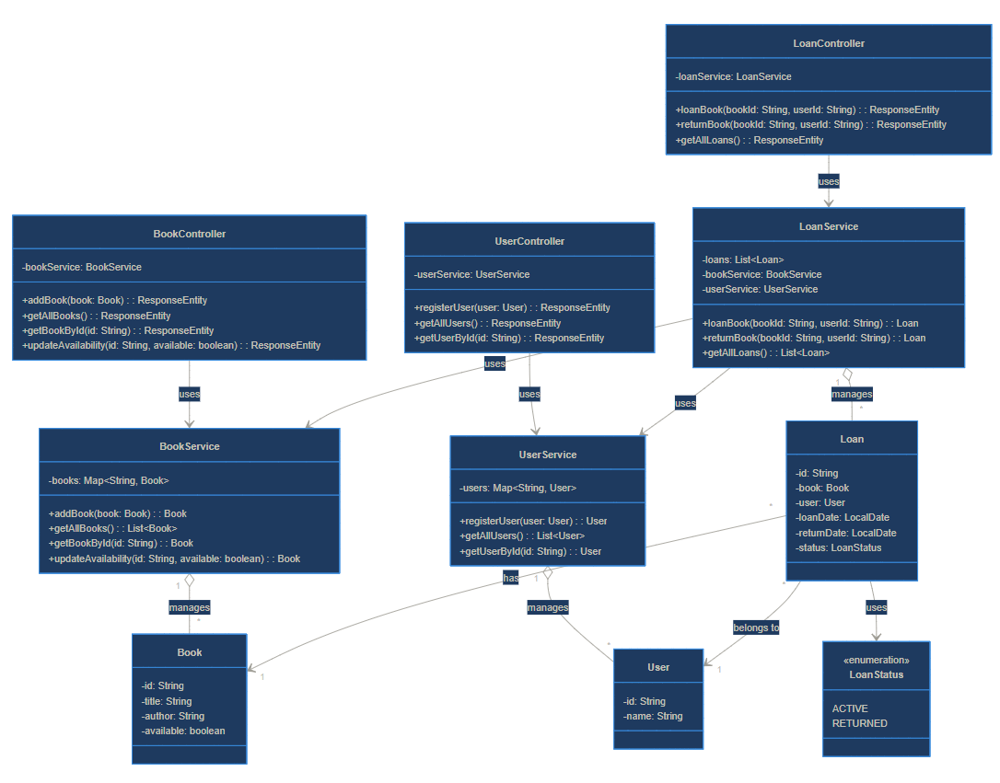
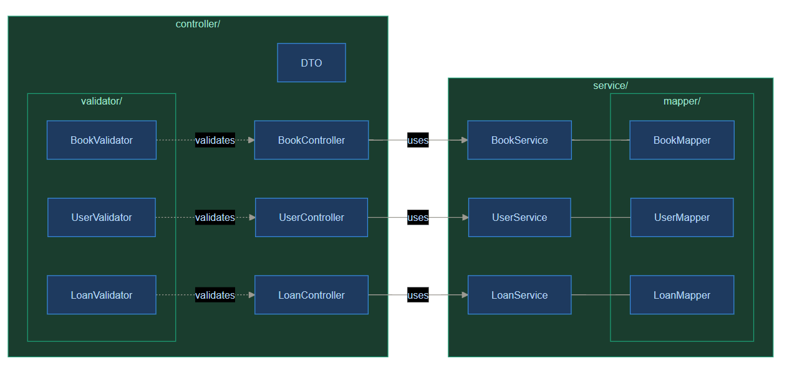
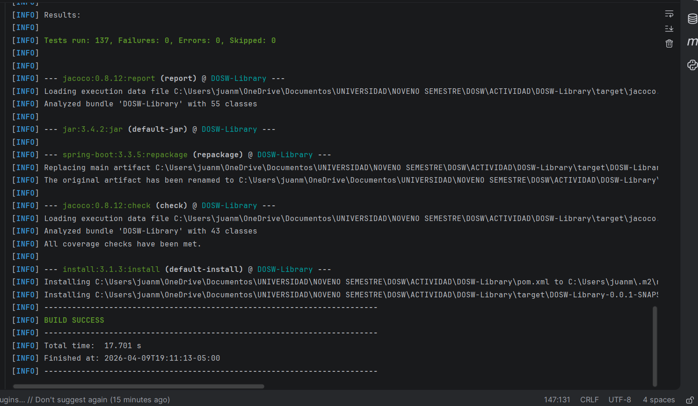
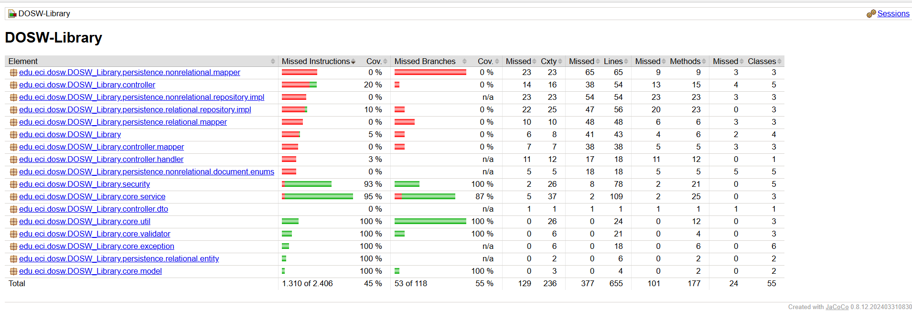
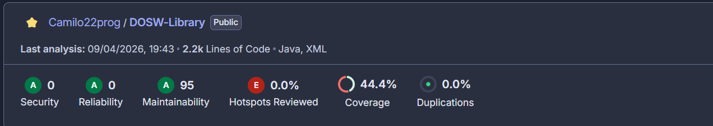

# DOSW Library API

Sistema de gestión de biblioteca desarrollado con **Spring Boot 3** y **Java 21**, aplicando metodología **TDD** (Test-Driven Development).

---

## Arquitectura del proyecto
```
src/
├── main/java/edu/eci/dosw/DOSW_Library/
│   ├── controller/              # Endpoints REST
│   │   ├── dto/                 # Data Transfer Objects
│   │   ├── handler/             # Manejadores de excepciones HTTP
│   │   └── mapper/              # Conversión Model ↔ DTO
│   ├── core/                    # Núcleo del dominio
│   │   ├── model/               # Entidades del dominio
│   │   ├── service/             # Lógica de negocio
│   │   ├── repository/          # Interfaces de repositorio
│   │   ├── exception/           # Excepciones personalizadas
│   │   ├── validator/           # Validaciones de entrada
│   │   └── util/                # Utilidades generales
│   ├── persistence/             # Implementaciones de persistencia
│   │   ├── nonrelational/       # Capa NoSQL (MongoDB)
│   │   │   ├── document/        # Documentos MongoDB
│   │   │   │   ├── embedded/    # Documentos embebidos
│   │   │   │   └── enums/       # Enumeraciones
│   │   │   ├── mapper/          # Conversión Document ↔ Model
│   │   │   └── repository/impl/ # Implementaciones NoSQL
│   │   └── relational/          # Capa SQL (JPA/Hibernate)
│   │       ├── entity/          # Entidades JPA
│   │       ├── mapper/          # Conversión Entity ↔ Model
│   │       └── repository/impl/ # Implementaciones SQL
│   └── security/                # Configuración de seguridad
└── main/resources/
    ├── static/                  # Recursos estáticos
    └── templates/               # Plantillas
```

## Diagramas

### Diagrama de Clases


### Diagrama de Arquitectura de Capas


## Cómo correr el proyecto

### Prerrequisitos

- Java 21
- Maven 3.9+

### Ejecutar la aplicación

```bash
mvn spring-boot:run
```

La API queda disponible en: `http://localhost:8080`

Swagger UI: `http://localhost:8080/swagger-ui/index.html`

---

##  Ejecución de la API

### Endpoints disponibles

| Método | Endpoint | Descripción |
|--------|----------|-------------|
| `POST` | `/auth/login` | Iniciar sesión |
| `GET` | `/api/users` | Listar usuarios |
| `POST` | `/api/users` | Registrar usuario |
| `GET` | `/api/users/{id}` | Buscar usuario por ID |
| `GET` | `/api/loans` | Listar préstamos |
| `POST` | `/api/loans` | Crear préstamo |
| `PATCH` | `/api/loans/{loanId}/return` | Devolver libro |
| `GET` | `/api/loans/user/{userId}` | Listar préstamos por usuario |
| `GET` | `/api/books` | Listar libros |
| `POST` | `/api/books` | Agregar libro |
| `PATCH` | `/api/books/{id}/stock` | Actualizar stock |
| `GET` | `/api/books/{id}` | Buscar libro por ID |

### Pruebas en Swagger
- Link del video de demostracion:https://youtu.be/nrTU-mCKFzA
- Prueba de funcionamiento reto #5: https://youtu.be/ObnF-hVDBIA
- Prueba de funcionamiento reto #8:https://youtu.be/UyTLlGTmIfY

### Pruebas implementadas

#### `BookServiceTest`
| Test | Descripción |
|------|-------------|
| `testAddBook_newBook_success` | Verifica que un libro nuevo se agrega correctamente |
| `testAddBook_existingBook_accumulates` | Verifica que las copias se acumulan si el libro ya existe |
| `testAddBook_nullBook_throwsException` | Verifica excepción con libro null |
| `testAddBook_zeroTotalCopies_throwsException` | Verifica excepción cuando totalCopies es 0 |
| `testGetAllBooks_returnsList` | Verifica que retorna la lista completa de libros |
| `testGetBookById_found` | Verifica búsqueda exitosa por ID |
| `testGetBookById_notFound_throwsException` | Verifica excepción cuando el libro no existe |
| `testUpdateStock_success` | Verifica actualización de stock correctamente |
| `testUpdateStock_zeroTotal_throwsException` | Verifica excepción cuando totalCopies es 0 |
| `testUpdateStock_availableExceedsTotal_throwsException` | Verifica excepción cuando availableCopies supera totalCopies |
| `testUpdateStock_negativeAvailable_throwsException` | Verifica excepción con availableCopies negativo |
| `testHasAvailableCopies_true` | Verifica que retorna true cuando hay copias disponibles |
| `testHasAvailableCopies_false_whenZero` | Verifica que retorna false cuando availableCopies es 0 |
| `testHasAvailableCopies_false_whenNotFound` | Verifica que retorna false cuando el libro no existe |
| `testDecrementCopy_success` | Verifica decremento exitoso de copia disponible |
| `testDecrementCopy_noStock_throwsException` | Verifica excepción cuando no hay stock para decrementar |
| `testIncrementCopy_success` | Verifica incremento exitoso de copia disponible |

#### `UserServiceTest`
| Test | Descripción |
|------|-------------|
| `testRegisterUser_success` | Verifica registro exitoso de usuario |
| `testRegisterUser_duplicateUsername_throwsException` | Verifica excepción cuando el username ya existe |
| `testRegisterUser_nullUser_throwsException` | Verifica excepción con usuario null |
| `testRegisterUser_blankName_throwsException` | Verifica excepción con nombre vacío |
| `testRegisterUser_blankUsername_throwsException` | Verifica excepción con username vacío |
| `testRegisterUser_blankPassword_throwsException` | Verifica excepción con contraseña vacía |
| `testGetAllUsers_returnsList` | Verifica que retorna la lista completa de usuarios |
| `testGetAllUsers_emptyList` | Verifica que retorna lista vacía cuando no hay usuarios |
| `testGetUserById_found` | Verifica búsqueda exitosa por ID |
| `testGetUserById_notFound_throwsException` | Verifica excepción cuando el usuario no existe |

#### `LoanServiceTest`
| Test | Descripción |
|------|-------------|
| `testCreateLoan_success` | Verifica creación exitosa de préstamo y decremento de copia |
| `testCreateLoan_userNotFound` | Verifica excepción cuando el usuario no existe |
| `testCreateLoan_bookNotFound` | Verifica excepción cuando el libro no existe |
| `testCreateLoan_bookNotAvailable` | Verifica excepción cuando el libro no tiene copias disponibles |
| `testCreateLoan_exceedsMaxLimit` | Verifica excepción cuando el usuario supera el límite de préstamos |
| `testCreateLoan_blankUserId_throwsException` | Verifica excepción con userId vacío |
| `testCreateLoan_blankBookId_throwsException` | Verifica excepción con bookId vacío |
| `testReturnLoan_success` | Verifica devolución exitosa e incremento de copia |
| `testReturnLoan_alreadyReturned_throwsException` | Verifica excepción cuando el préstamo ya fue devuelto |
| `testReturnLoan_blankId_throwsException` | Verifica excepción con loanId vacío |
| `testGetAllLoans_returnsList` | Verifica que retorna la lista completa de préstamos |
| `testGetLoansByUser_filtersCorrectly` | Verifica que filtra correctamente los préstamos por usuario |
| `testGetLoansByUser_userNotFound` | Verifica excepción cuando el usuario no existe |
| `givenOneLoanRegistered_whenFindById_thenReturnLoanWithCorrectId` | Verifica consulta exitosa de préstamo por ID |
| `givenNoLoansRegistered_whenGetAll_thenReturnEmptyList` | Verifica lista vacía cuando no hay préstamos |
| `givenNoLoansRegistered_whenCreateLoan_thenLoanIsCreatedSuccessfully` | Verifica creación exitosa cuando no hay préstamos previos |
| `givenOneLoanRegistered_whenDelete_thenDeletionIsSuccessful` | Verifica eliminación exitosa de un préstamo |
| `givenOneLoanRegistered_whenDeleteAndGetAll_thenReturnEmptyList` | Verifica que tras eliminar, la consulta retorna lista vacía |

### Resultado de las pruebas


##  Cobertura de código — JaCoCo

### Generar el reporte

```bash
mvn test
```

El reporte queda en: `target/site/jacoco/index.html`

### Resultado de cobertura

---

##  Análisis estático — SonarCloud

### Ejecutar el análisis

```bash
mvn sonar:sonar -Dsonar.token=TU_TOKEN_AQUI
```

El dashboard queda disponible en: `https://sonarcloud.io/organizations/camilo22prog`

### Resultado del análisis


## Tecnologías usadas

- **Java 21**
- **Spring Boot 3.5**
- **Lombok**
- **JUnit 5**
- **JaCoCo** — cobertura de código
- **SonarCloud** — análisis estático
- **SpringDoc OpenAPI** — documentación Swagger

---

##  Autor

Desarrollado por **Camilo Melo** — Escuela Colombiana de Ingeniería Julio Garavito  
Curso: DOSW — Diseño y Construcción de Software.